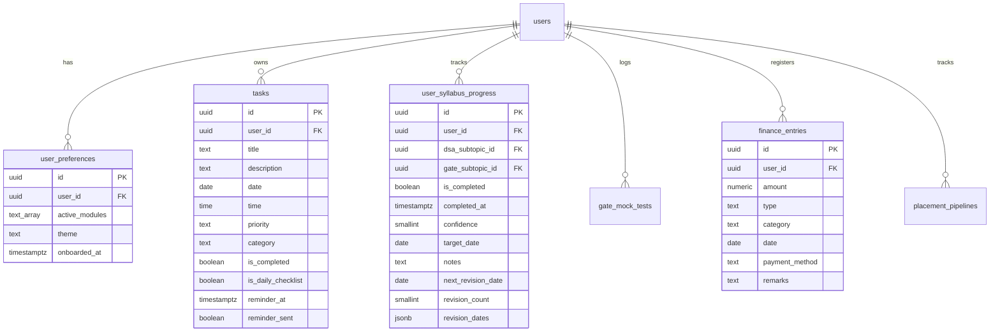

# StudySync (My Planner) - Project Understanding

Welcome to the **StudySync** project workspace (also referred to as **My Planner** or **My Calendar**). This is a comprehensive, full-stack personal planner and study/placement prep companion app built specifically for engineering students (targeting B.Tech AI & DS curricula).

Below is a detailed analysis of the project's architecture, data schema, active features, algorithms, and tech stack.

---

## 🏗️ Architecture & Technology Stack

The application is structured as a modern Single Page Application (SPA) backed by a BaaS (Backend-as-a-Service) backend.

| Layer | Technology | Details / Purpose |
|---|---|---|
| **Frontend Framework** | **React 19** | Uses modern React constructs, custom hooks, and state. |
| **Routing** | **React Router DOM v7** | Manages SPA routes including auth guards (`ProtectedRoute`) and module-specific permissions (`ModuleGuard`). |
| **Styling** | **TailwindCSS 4** | Configured with Vite for modern, light/dark mode styling. |
| **Bundler / Dev Server**| **Vite 8** | High-performance developer tooling and packaging. |
| **Backend & Database**  | **Supabase** | Uses PostgreSQL database, Go-based Auth, Row Level Security (RLS) policies, and SQL migrations. |
| **Notifications** | **Web Notifications API** | Native browser push notifications, synchronized with database timestamps. |
| **Deployment** | **Vercel** | SPA routing via `vercel.json` and environmental bindings. |

---

## 📂 Codebase & Folder Structure

Here is the functional layout of the key directories:

*   **`src/`**: Contains the client application source.
    *   [App.jsx](file:///c:/Users/Dragon/OneDrive/Documents/Projects/My%20Planner/src/App.jsx): Bootstraps routing, manages auth listener sessions, and configures notifications.
    *   **`components/`**: Core reusable layout wrappers and UI components.
        *   [ProtectedRoute.jsx](file:///c:/Users/Dragon/OneDrive/Documents/Projects/My%20Planner/src/components/ProtectedRoute.jsx): Verifies authentication and handles redirection to onboarding if the user profile is new.
        *   [ModuleGuard.jsx](file:///c:/Users/Dragon/OneDrive/Documents/Projects/My%20Planner/src/components/ModuleGuard.jsx): Guards specific pages (GATE, DSA, Finance, Placement) according to modules enabled in `user_preferences`.
        *   [Layout.jsx](file:///c:/Users/Dragon/OneDrive/Documents/Projects/My%20Planner/src/components/Layout.jsx) & [AppShell.jsx](file:///c:/Users/Dragon/OneDrive/Documents/Projects/My%20Planner/src/components/Layout/AppShell.jsx): Defines the layout structure, sidebar, top bar, and theme controls.
        *   **`ui/`**: Reusable primitives like [Toast.jsx](file:///c:/Users/Dragon/OneDrive/Documents/Projects/My%20Planner/src/components/ui/Toast.jsx) and [Skeleton.jsx](file:///c:/Users/Dragon/OneDrive/Documents/Projects/My%20Planner/src/components/ui/Skeleton.jsx).
    *   **`hooks/`**: React custom hooks.
        *   [useAuth.js](file:///c:/Users/Dragon/OneDrive/Documents/Projects/My%20Planner/src/hooks/useAuth.js): Hooks into Supabase Auth sessions, fetches global user preferences, and applies themes (`.dark` class toggles).
    *   **`lib/`**: Helpers, utilities, and integrations.
        *   [supabase.js](file:///c:/Users/Dragon/OneDrive/Documents/Projects/My%20Planner/src/lib/supabase.js): Clientside Supabase initialization using environment variables.
        *   [notifications.js](file:///c:/Users/Dragon/OneDrive/Documents/Projects/My%20Planner/src/lib/notifications.js): Logic for local native reminders, 9:00 AM daily digests, and permissions request queues.
        *   [spacedRepetition.js](file:///c:/Users/Dragon/OneDrive/Documents/Projects/My%20Planner/src/lib/spacedRepetition.js): Interval schedules calculations implementing spaced revision rules.
    *   **`pages/`**: Primary page interfaces.
        *   [Dashboard.jsx](file:///c:/Users/Dragon/OneDrive/Documents/Projects/My%20Planner/src/pages/Dashboard.jsx): Central landing board featuring metric quick cards and activity charts.
        *   [Tasks.jsx](file:///c:/Users/Dragon/OneDrive/Documents/Projects/My%20Planner/src/pages/Tasks.jsx): Task list and interactive monthly calendar picker.
        *   [GateTracker.jsx](file:///c:/Users/Dragon/OneDrive/Documents/Projects/My%20Planner/src/pages/GateTracker.jsx): Syllabus subject completion and spaced revision triggers.
        *   [DSATracker.jsx](file:///c:/Users/Dragon/OneDrive/Documents/Projects/My%20Planner/src/pages/DSATracker.jsx): Structured LeetCode/CodeChef practice targets and solve streak trackers.
        *   [Finance.jsx](file:///c:/Users/Dragon/OneDrive/Documents/Projects/My%20Planner/src/pages/Finance.jsx): Ledger accounting, budget status trackers, and velocity-based spending forecast models.
        *   [PlacementPrep.jsx](file:///c:/Users/Dragon/OneDrive/Documents/Projects/My%20Planner/src/pages/PlacementPrep.jsx): Pipeline dashboards tracking interview stages, applications, and task logs.
        *   [AiManager.jsx](file:///c:/Users/Dragon/OneDrive/Documents/Projects/My%20Planner/src/pages/AiManager.jsx): AI Coach chat integrating active student planner metrics (tasks, finance, study tracking) to prompt schedule revisions.
        *   [Onboarding.jsx](file:///c:/Users/Dragon/OneDrive/Documents/Projects/My%20Planner/src/pages/Onboarding.jsx): Multi-step registration questions that customize database preferences.
        *   [Settings.jsx](file:///c:/Users/Dragon/OneDrive/Documents/Projects/My%20Planner/src/pages/Settings.jsx): System preferences, profile actions, and budget targets.
*   **`supabase/migrations/`**: PostgreSQL configuration and schema seeds.
    *   `001_tasks.sql` to `012_placement_prep.sql`: Sequenced schema definitions including table creation, indexes, foreign keys, and RLS (Row Level Security) policies.

---

## 🗃️ Database Schema Summary

All PostgreSQL tables are fully secured using Row Level Security (RLS), restricting read/write access to matching `auth.uid() = user_id`.



---

## ⚙️ Core Algorithms & Workflows

### 1. Spaced Repetition Scheduling
When a student completes a GATE/DSA study subtopic:
*   Revision schedules are computed in [spacedRepetition.js](file:///c:/Users/Dragon/OneDrive/Documents/Projects/My%20Planner/src/lib/spacedRepetition.js).
*   Revision intervals: **1 → 4 → 7 → 30 → 60 days**.
*   A query filters subtopics where `next_revision_date <= TODAY` to populate the study reminder queue on the dashboard.

### 2. Browser Notifications Dispatch
*   Native push alerts are configured in [notifications.js](file:///c:/Users/Dragon/OneDrive/Documents/Projects/My%20Planner/src/lib/notifications.js).
*   **Morning Digest**: Automatically schedules a local `setTimeout` timer to alert the user at 9:00 AM local time.
*   **Task Reminders**: Evaluates uncompleted tasks due within 24 hours, computes millisecond delays relative to local current time, and schedules triggers.
*   **State Sync**: Once a reminder fires, the client updates `reminder_sent = true` in Supabase to prevent duplicate schedules on reload.

### 3. AI Day Manager & Coach
*   The AI Assistant fetches context from 5 tables (tasks, dsa, gate syllabus, gate tests, finances).
*   **Integration Channels**:
    1.  **Supabase Edge Function (`ai-chat`)**: Principal backend endpoint proxy.
    2.  **Anthropic API fallback**: Direct client-side fetch using `VITE_ANTHROPIC_API_KEY` to prompt Claude.
    3.  **Local Simulator Heuristics**: Deterministic fallback engine responding with templates for study schedules, finances, or placement prep based on keyword parsing.

### 4. Smart Finance Forecasts
*   Analyzes spending trends on the Finance page.
*   Estimates end-of-month forecasts using daily average spending velocity.
*   Provides risk alerts when projected expenditures exceed limits configured in Settings.

---

## 🎯 Verification and Local Development

To start editing the codebase:
1.  Verify that your `.env.local` file contains valid credentials:
    ```env
    VITE_SUPABASE_URL=https://your-project-id.supabase.co
    VITE_SUPABASE_ANON_KEY=your-anon-key-here
    ```
2.  Run the local development server:
    ```bash
    npm run dev
    ```
3.  Format and check code lint rules:
    ```bash
    npm run lint
    ```
